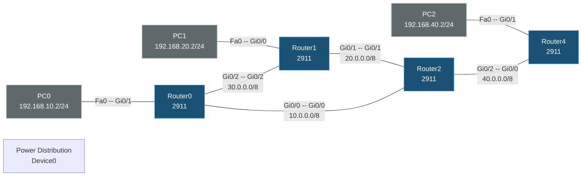

# Dynamic Routing Lab (RIP)

## Topology



## Devices

| Device | Model | Role |
|---|---|---|
| Router0 | 2911 | Core router — links to R1 and R2, LAN for PC0 |
| Router1 | 2911 | Core router — links to R0 and R2, LAN for PC1 |
| Router2 | 2911 | Core hub — links to R0, R1, and R4 |
| Router4 | 2911 | Edge router — link to R2, LAN for PC2 |
| PC0 | PC-PT | 192.168.10.2/24, GW 192.168.10.1 |
| PC1 | PC-PT | 192.168.20.2/24, GW 192.168.20.1 |
| PC2 | PC-PT | 192.168.40.2/24, GW 192.168.40.1 |
| Power Distribution Device0 | iot_pdu | Present, unconnected |

## IP Plan

| Link / Subnet | CIDR | Router0 | Router1 | Router2 | Router4 |
|---|---|---|---|---|---|
| R0 ↔ R2 | 10.0.0.0/8 | Gi0/0 = 10.0.0.2 | — | Gi0/0 = 10.0.0.1 | — |
| R0 ↔ R1 | 30.0.0.0/8 | Gi0/2 = 30.0.0.1 | Gi0/2 = 30.0.0.2 | — | — |
| R1 ↔ R2 | 20.0.0.0/8 | — | Gi0/1 = 20.0.0.2 | Gi0/1 = 20.0.0.1 | — |
| R2 ↔ R4 | 40.0.0.0/8 | — | — | Gi0/2 = 40.0.0.1 | Gi0/0 = 40.0.0.2 |
| PC0 LAN | 192.168.10.0/24 | Gi0/1 = 192.168.10.1 | — | — | — |
| PC1 LAN | 192.168.20.0/24 | — | Gi0/0 = 192.168.20.1 | — | — |
| PC2 LAN | 192.168.40.0/24 | — | — | — | Gi0/1 = 192.168.40.1 |

## Routing

All four routers run RIP, each advertising the directly-connected classful networks it owns:

- **Router0**: `network 10.0.0.0`, `network 30.0.0.0`, `network 192.168.10.0`
- **Router1**: `network 20.0.0.0`, `network 30.0.0.0`, `network 192.168.20.0`
- **Router2**: `network 10.0.0.0`, `network 20.0.0.0`, `network 40.0.0.0`
- **Router4**: `network 40.0.0.0`, `network 192.168.40.0`

This gives full any-to-any reachability between the three PC subnets via RIP-learned routes (R0↔R2↔R1 triangle plus the R2→R4 spur).

## Configs

### Router0
```
hostname Router0
interface GigabitEthernet0/0
 ip address 10.0.0.2 255.0.0.0
interface GigabitEthernet0/1
 ip address 192.168.10.1 255.255.255.0
interface GigabitEthernet0/2
 ip address 30.0.0.1 255.0.0.0
router rip
 network 10.0.0.0
 network 30.0.0.0
 network 192.168.10.0
```

### Router1
```
hostname Router1
interface GigabitEthernet0/0
 ip address 192.168.20.1 255.255.255.0
interface GigabitEthernet0/1
 ip address 20.0.0.2 255.0.0.0
interface GigabitEthernet0/2
 ip address 30.0.0.2 255.0.0.0
router rip
 network 20.0.0.0
 network 30.0.0.0
 network 192.168.20.0
```

### Router2
```
hostname Router2
interface GigabitEthernet0/0
 ip address 10.0.0.1 255.0.0.0
interface GigabitEthernet0/1
 ip address 20.0.0.1 255.0.0.0
interface GigabitEthernet0/2
 ip address 40.0.0.1 255.0.0.0
router rip
 network 10.0.0.0
 network 20.0.0.0
 network 40.0.0.0
```

### Router4
```
hostname Router4
interface GigabitEthernet0/0
 ip address 40.0.0.2 255.0.0.0
interface GigabitEthernet0/1
 ip address 192.168.40.1 255.255.255.0
interface GigabitEthernet0/2
 no ip address
 shutdown
router rip
 network 40.0.0.0
 network 192.168.40.0
```

### PCs
```
PC0: 192.168.10.2 / 255.255.255.0 / GW 192.168.10.1
PC1: 192.168.20.2 / 255.255.255.0 / GW 192.168.20.1
PC2: 192.168.40.2 / 255.255.255.0 / GW 192.168.40.1
```
